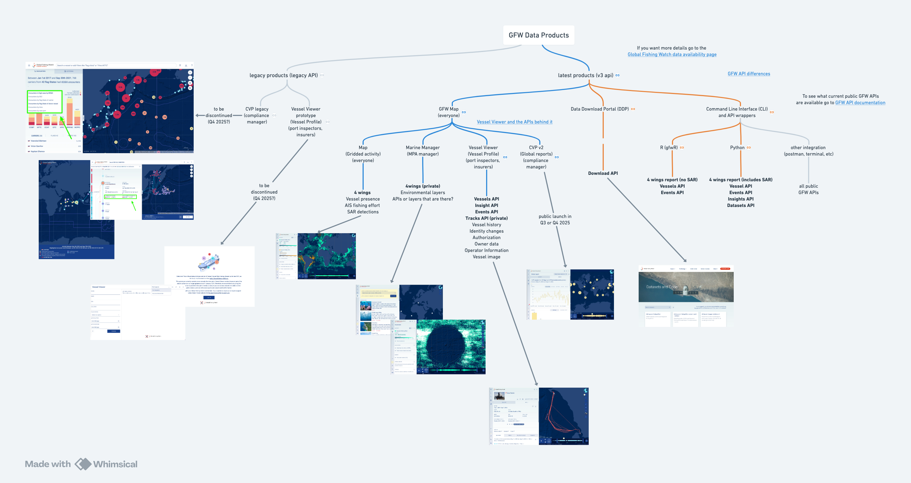
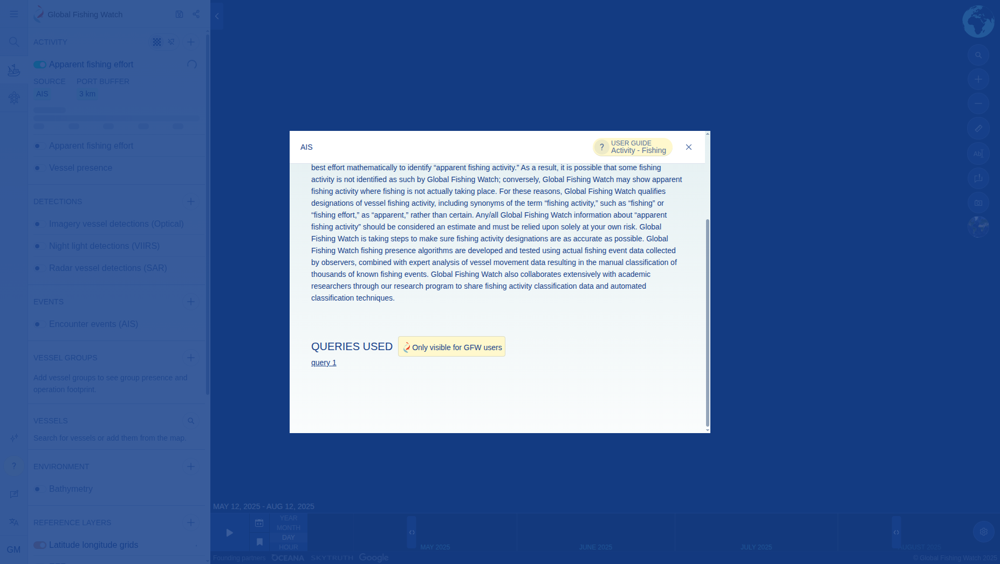

# BigQuery to APIs to Products
 
The flow of data into [**GFW Products**](https://docs.google.com/document/d/1JY0umwJ5j8qFpOb90OuaUOo43y45yExaenNWzUlbkCo/edit?tab=t.0)   is enabled through a set of **Application Programming Interfaces (APIs)**. This page documents the key APIs, the underlying queries powering them, and how they support user-facing products.

## GFW APIs 

[GFW Data Products Diagram link](https://whimsical.com/gfw-data-products-7WiWeFz5KVMxndC8gaD7DS)

### Current GFW APIs (v3)

- [GFW API Portal](https://globalfishingwatch.org/our-apis/documentation#data-available) - different end points and which products call different end points
  - [Vessel Viewer API endpoints](https://globalfishingwatch.org/our-apis/assets/2024_Vessel_Viewer_and_APIs_behind_It.pdf) - Vessel Viewer specific API end points and examples
- A mapping of [Global Fishing Watch Data Availability](https://globalfishingwatch.org/global-fishing-watch-data-availability) 
  - [Documentation on differences between GFW data when accessing in the API, the API wrappers, and Data Download Portal](https://globalfishingwatch.org/our-apis/assets/APIs_gfwr_and_Data_Downloads_Products_Differences.pdf)

### Products Using Legacy APIs

Some older products are still using legacy APIs:

- **Legacy CVP**
- **Vessel Profile Prototype**

## Accessing API Logic 

To expose data from **BigQuery (BQ)** in our products, we organize it into **API datasets**. These are our way of grouping all data required for the Map and API services.

### via API datasets site

**API query logic** is maintained in this [API datasets hub](https://datasets.globalfishingwatch.org/datasets/). The API datasets hub returns the list of API Datasets that are used in our API.

- Username = `gfw_doc`
- Password = `datasets`

#### How to Use the API Datasets Hub

1. **Select the Environment**  
   Use the dropdown in the top-right corner to select the environment.  
   
   ➤ Choose **`Production`** to view datasets currently used in our **Public APIs** and on the **Map**.

2. **Select a Dataset Group**  
   Once the environment is set, pick the dataset group you want to explore — for example, `AIS`.  
   
   Within each group, datasets are categorized (e.g., `Events`, `Insights`, etc.). All available versions are listed under each category.

3. **Find the Latest Versions**  
   Datasets linked to **Pipe v3** typically include `v3.0` in their version string.  
   
   Example: `public-global-fishing-events:v3.01`

4. **Review Dataset Logic**  
In the final column of each dataset entry, `Queries & sources` you'll find links to the API quieries.

These links let you review the logic applied during API publication.

### via the Map

Staff can login to Map with GFW account and click in the info pop up. User will see a section "Queries used" where you can get the same links describe above to the API logic (see example of fishing effort below).

## Accessing BigQuery Table logic

To view underlying **BigQuery table logic**:

- Open the relevant table in BigQuery.
- Click the **"Details"** tab to find:
  - Source tables
  - (When available) links to the GitHub code that generates each table
- Click the **"Lineage"** tab for a flux diagram of the source tables that feed into the BQ table

> ⚠️ If the logic in the API hub seems outdated or unclear, contact **Gisela**.

## Caveats and Considerations

**Permissions**

Access to API data may be restricted depending on your user role. Some datasets may only be available to:

- Internal GFW staff
- JAC members
- Specific partners

As a result, data visible through the API can vary based on your credentials.

**Data Filters**

We’ve made our best effort to document all filters and permission scopes on each API. However, gaps may still exist.

If you're uncertain about:

- Why data may be missing or inconsistent
- What filters are applied

Please contact **Gisela** for clarification.