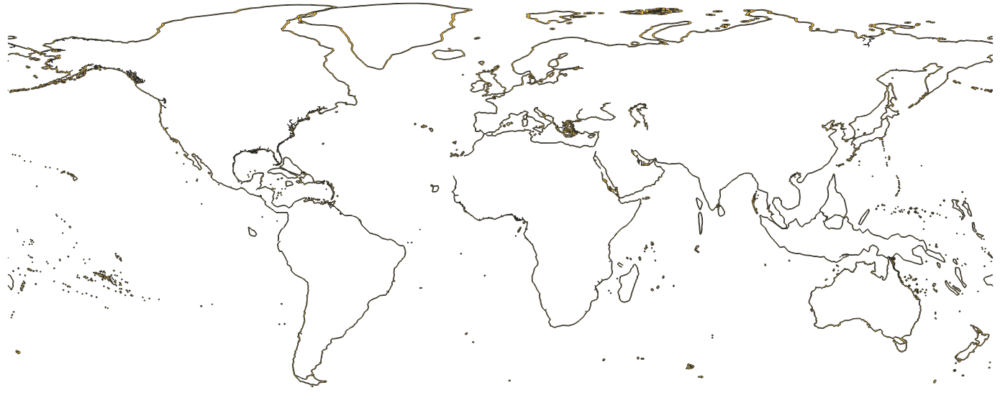

<!--Owner: Hannah Linder
Last edited time: 1 de marzo de 2024 13:38
Created time: 1 de marzo de 2024 13:02-->
# 12 NM Boundary

World 12 Nautical Miles Zone (Territorial Seas)

## Key Attributes

| **Layer name** | eez12nm |
| --- | --- |
| **Unique id field** | MRGID_EEZ |
| **Short description** | World 12 Nautical Miles Zone (Territorial Seas) v3 |
| **Source** | [https://www.marineregions.org/downloads.php](https://www.marineregions.org/downloads.php) |
| **Citation** | Flanders Marine Institute (2024). Union of the ESRI Country shapefile and the Exclusive Economic Zones (version 4). Available online at [https://www.marineregions.org/](url). [https://doi.org/10.14284/698](url). Consulted on 2025-05-26. |
| **Attribution** | Copyright Flanders Marine Institute - marineregions.org |
| **Last updated** | 2023-10-25 |
| **License** | [CC-BY](https://creativecommons.org/licenses/by/4.0/) |

## Description

12 Nautical Mile boundary that is the limit of a nation’s territorial waters. From [Marine Regions](https://www.marineregions.org/)

{fig-align="center" width=80%}

[[Known Issues]](https://www.marineregions.org/files/World_12NM_v3_20191118_known_issues.txt)

## Data access

**GCS**

- Original: gs://pipe-regions-layers-us-central1/eez_12nm/original/World_12NM_v4_20231025.zip
- Normalized: gs://pipe-regions-layers-us-central1/eez_12nm/eez_12nm_v4.shp.zip

**Bigquery**

- Normalized:  world-fishing-827.pipe_regions_layers.eez_12nm_v4
- Processed for S2 lookup::  world-fishing-827.pipe_regions_layers.eez_12nm_v4_S2_10
