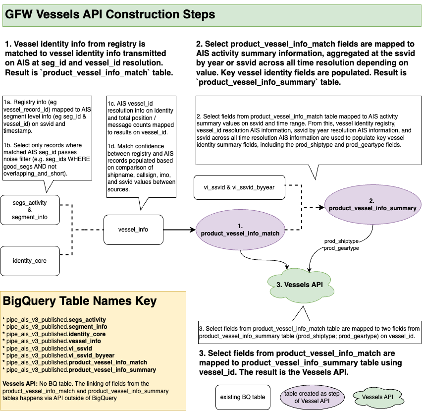
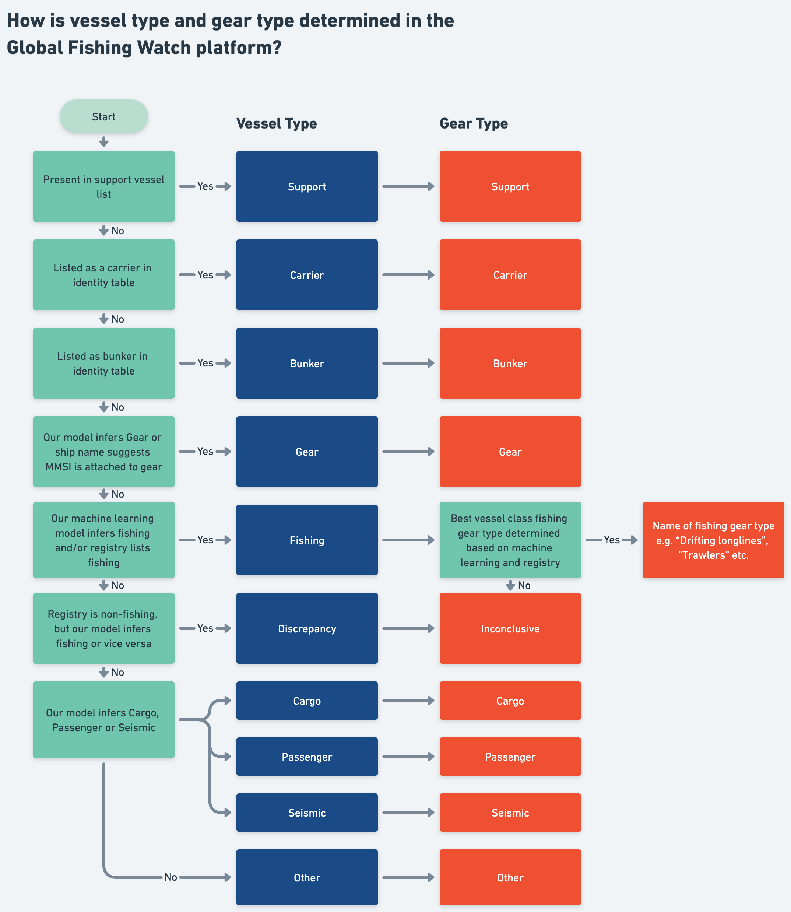

# Product Vessel Info Summary (PVIS) {#pvis}

The **Product Vessel Info Summary (PVIS)** table is the main source for determining which vessels are included in GFW Products and what identity information is shown for each vessel. The table also contains additional fields related to vessel activity, type, and noise, which are not displayed in Products. These fields are for GFW technical staff with access to BigQuery, to be used in analysis and also to be used to understand why a vessel appears in Products the way it does.

**Owner:** Willa

Previously, this table was called **All Vessels v2** but was renamed to **Product Vessel Info Summary** in **Pipeline 3.0**. For more details, refer to the [Updates](#updates) section.

## Key Tables

+ `pipe_ais_v3_published.product_vessel_info_summary`
+ `pipe_production_v20201001.all_vessels_byyear_v2` - the previous version of the table table, maintained in pipeline 2.5. 

## Source Tables

The Product Vessel Info Summary table uses the following source tables, below. For more information on how these source tables are utilized to populate the Product Vessel Info Summary table, please see the [Product Vessel Info Summary Data Template](https://docs.google.com/document/d/1YwEFUtSAIujy8j8BO1DFkg6kqu3xcP8T5yZW_SsBH1Q/edit). The documentation for All Vessels v2, the previous version of the Product Vessel Info Summary Table can be found [here](https://docs.google.com/document/d/1zhYOFaur-XNv5i1q3cE-IGn84bcJRNAJqTya0BIBmQo/edit).

+ `pipe_ais_v3_published.product_vessel_info_match` - internal table not to be used outside of products. This table was created to match our `vessel_id` (created to consolidate AIS transmitted data) to our registry matched table (`identity_core`) so that Products automatically connect `vessel_id` (from consolidated AIS records) to any existing registry records. 

* `pipe_ais_v3_published.identity_core`
* `pipe_ais_v3_published.vessel_info`
* `pipe_ais_v3_published.segs_activity`
* `pipe_ais_v3_published.segment_info`

+ `pipe_ais_v3_published.vi_ssvid`
+ `pipe_ais_v3_published.vi_ssvid_byyear`
+ `pipe_ais_v3_internal.purse_seine_support_vessels_byyear`     

## Data Description

The Product Vessel Info Summary table is a step in the Vessels API, which links AIS records to registry records and is intended to act as a one stop shop for vessel identity for GFW Products. At the product level we want to provide the cleanest information we have on vessel identity, which is why there is an extra layer of logic to lay out a hierarchy for how to represent a vessel in Products when there is conflicting information. 

We want to be transparent on this hierarchy and the logic behind it, internally, but also externally for all users. As a result, the table includes numerous summary fields on vessel activity, noise, and identity. While these extra details are not featured in Products, the information is intended to provide context for internal staff to understand why a vessel is represented the way it is. Further these fields allow analysts to use the Product Vessel Info Summary table more flexibly than how it is included in Products, to meet broader uses cases. Being able to use the Product Vessel Info Summary table for analysis that are separate from Products is valuable, as it is still easy to link analysis back to what is in Products and allows analysts to easily identify how the vessels in their reports reflect what is in Product, what is miss from Product, and what is represented differently from what is in Product, and why. 

How the Vessels API is populated is highlighted in the diagram below; specifically how the Product Vessel Info Summary table fits into the Vessels API. 

 
 
[Vessels API diagram link](https://drive.google.com/file/d/1w-H8JawKDdjj0bikUXlXpZ-I8vNvPccm/view?usp=sharing)

 
 

[Whimsical for how `prod_shiptype` and `prod_geartype` are populated](https://whimsical.com/all-vessels-7mpjsDLTutacKzUn4jPtHA)

Please see the [Product Vessel Info Summary Data Template](https://docs.google.com/document/d/1YwEFUtSAIujy8j8BO1DFkg6kqu3xcP8T5yZW_SsBH1Q/edit) for field definitions of all fields in table. 

## Caveats and Known Issues

+ Please see the [Product Vessel Info Summary Data Template](https://docs.google.com/document/d/1YwEFUtSAIujy8j8BO1DFkg6kqu3xcP8T5yZW_SsBH1Q/edit) `Caveats` section and `FAQs` section for more on the following topics.

  * Caveats
  * Inaccuracies in inferred (neural net) class information
  * Possibility of error between ssvid and vessel id merger
  * FAQs
    * Why is a vessel I know to be a fishing vessel, not indicated as fishing on the Map?
    * What if a vessel is considered multiple gear types?
    * What should I do if I think a vessel type has been incorrectly assigned?
    * Why is my `vessel_id` NOT included in the Product Vessel Info Summary table (and thus in Products)?
    * Multiple Vessel IDs for a single unique hull
    * Why am I only seeing a short track segment when I search for a vessel that I know is transmitting on AIS across years?
    * Making sense of vessels with shiptype ‘Discrepancy’
    * What is the difference between `core_geartype` and `registry_vessel_class` fields?
+ **Noise filter:** Products only include non-noisy segments, and subsequently vessel_id's with at least one non-noisy `seg_id` (eg passes the `WHERE good_seg and NOT overlapping_and_short` filter) are excluded from Products. 

## Example Queries

+ Please see the [Product Vessel Info Summary Data Template](https://docs.google.com/document/d/1YwEFUtSAIujy8j8BO1DFkg6kqu3xcP8T5yZW_SsBH1Q/edit) `Use cases` section for example Queries expanding on the following questions:

  * How do I use the activity summary fields to understand vessel activity? 
  * How do I compare what the current product ship and gear type is in the product vessel info summary table to what was in the previous version of the table (all vessels v2)?
  * Discrepancy vessel example
  * Why is a vessel I know to be a fishing vessel, not indicated as fishing on the Map?
  * How can the Product Vessel Info Summary table be used to identify all possible fishing vessels? 
  + [vessel_id_connected_to_noisy_segment_check](https://github.com/GlobalFishingWatch/bigquery-documentation-wf827/blob/master/queries/vessel_id_connected_to_noisy_segment_check.sql) - if a vessel_id does not appear in the Product Vessel Info Summary table, the only reason this should happen is because the vessel_id is connected to only noisy segments. The example query allows users to input a vessel_id or ssvid and verify if the vessel_ids connected to the vessel have at least one non-noisy segment and should thus be included in the Product Vessel Info Summary table.

## Links

+ [Product Vessel Info Summary table data template documentation](https://docs.google.com/document/d/1YwEFUtSAIujy8j8BO1DFkg6kqu3xcP8T5yZW_SsBH1Q/edit): redundant in many ways to the GitWiki. Intended to flesh out field definitions and other data tables in a format accessible by non-github using staff.
+ [Outdated] All Vessels v2 resources
    * [Vessel API link to All vessels](https://globalfishingwatch.atlassian.net/wiki/spaces/TD/pages/507084801/Vessel+Identity+API+flow): Diagram showing how All Vessels v2 fits within the work flow of the Vessel Identity API
    * [All Vessels v2 Confluence](https://globalfishingwatch.atlassian.net/wiki/spaces/TD/pages/509345793/How+to+generate+the+all+vessels+byyear+v2+v+table+prototype): Includes source tables and code used to populated All Vessels v2 table. 
    * [All Vessels v2 Tech Call slides](https://docs.google.com/presentation/d/1JqegdW8X4jjrkCVIF2ehukuI894BAQQgQ0Z7D0tOK-s/edit?usp=sharing): from bi weekly tech call presentation on July 27th 2023

## Updates
Last updated on **September 30th, 2024**

+ **[Aug 2024]** Pipeline 3.0 released in Products alongside DeckGL release. This marks official shift to using `product_vessel_info_summary` table, and retiring `all_vessels_v2` for both internal/staff and external users.
+ **[2024 - Pipeline 3.0]** In Pipeline 3.0, `all_vessels_byyear_v2` renamed to `product_vessel_info_summary`
+ **[Oct 26 2023]** `all_vessels_byyear_v2` released in Products as part of public Vessel Viewer (VV 2.0) release, with updates from internal feedback survey. 

  **Updates to table:**
  * added most frequent imo transmitted on AIS
  * added most frequent callsign transmitted on AIS
  * renamed flag field to `mmsi_flag` to make it clear that this flag is populated based on the first 3 digits of the MMSI transmitted on AIS
  * added `gfw_best_flag` field, which is pulled from `vi_ssvid_byyear` table and considers AIS and registry information
  * added `core_flag`, which is the flag information in the identity core table if an AIS records is high confidence matched (eg based on MMSI and another identity value) to a hull id.
  * Within `prod_shiptype` field, added `'gear'` as a shiptype.
  * Within `prod_shiptype` field, eliminated the `'potential_fishing'` shiptype option, and reclassified those vessels to `‘fishing’` to reduce confusion. We maintained the `potential_fishing` boolean field (see data template for field definition). See whimsical in data template on how `shiptype` and `geartype` are designated for clarity on what this means for how `shiptype` is determined. (shout out to Matt for spearheading the whimsical)
  * changed how `prod_geartype` field is populated, to reflect exactly what is expected to be seen in Products.
  * added `potential_fishing_source` field. This indicates the highest confidence field used to inform the `potential_fishing` boolean field.

  **Impacts on other datasets:** 
For engineering reasons (mainly the maintenance of Vessel Viewer (prototype)), we need to maintain All Vessels v1 and the AIS Published Event datasets along side All Vessels v2. That said, for the time being there are two sets of published event tables. **Please use the following tables moving forward for analysis.** If you have any questions about this, please reach out.
    * all_vessels:
      `pipe_production_v20201001.all_vessels_byyear_v2`
    * coverage: `pipe_v20201001_api.indicators_coverage_blocks_v2`
    * encounters: `pipe_production_v20201001.published_events_encounters_v2` - carriers and fishing vessels are identified differently in  All Vessels v2. Thus which encounters are flagged as `carrier-fishing` and `support-fishing` and thus included publicly in map are different. See below for more details.
    * Carrier vessels (and bunker vessels) require a match to a hull_id in the identity core table to be flagged. The process for matching carrier vessel records to AIS records is more precise than what was originally implemented. As a result there are fewer carriers in products. Based on initial analysis, this change is a good one and should make our identification of carriers more accurate. I am still investigating this to make sure we aren’t systematically losing legitimate carrier vessels, and from the analysis so far, things look good.
    * Fishing vessels: The long standing bug which classified known fishing vessels to 'other' vessel type due to noise should now be fixed in the All Vessels v2 table. Further the list of vessels flagged as fishing is expanded. In addition to vessels that are flagged as `on_fishing_list_best` (the original filter for identifying fishing vessels) in the `vi_ssvid_byyear` table, vessels that are flagged as a fishing vessel in a registry on by the neural net are included as fishing vessels in Product if the vessel isn’t already flagged as a support, carrier, bunker, or discrepancy vessel (see whimsical in data template for visual flow diagram of what this looks like).
    * Fishing events: `pipe_production_v20201001.published_events_fishing_v2` fishing events query has been re-run on an expanded list of fishing vessels using the All Vessels v2 table as the source, where if a vessel is `potential_fishing` or `on_fishing_list_sr` (see data template for field definitions), then the vessel has fishing events populated for it. In Products, a narrower set of vessels have fishing events displayed (eg only vessels where `prod_shiptype = ‘fishing’`). This provided, depending on the use case, analysts may need to add an extra filter when using the published events fishing table. If you have any questions on this, please reach out.
    * loitering: `pipe_production_v20201001.published_events_loitering_v2`
    * port visits: `pipe_production_v20201001.published_events_port_visits_v2`
      
+ **[July 2023]** The `all_vessels_byyear_v2` table is shared internally.  
